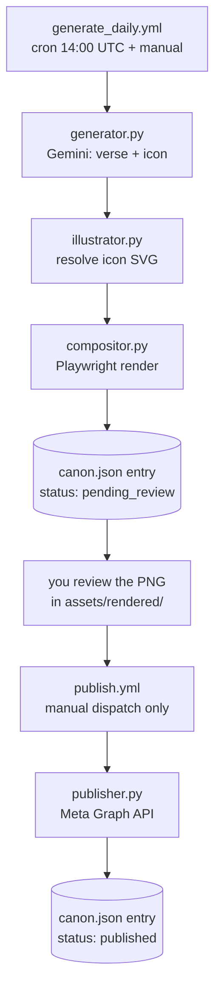

# Architecture

## Pipeline overview



Two independent GitHub Actions workflows, connected only through
`database/canon.json` — there is no direct handoff between them, and neither
workflow ever triggers the other.

## Modules (`src/`)

- **`config.py`** — every constant in one place: the 4 palettes, chapter
  length (30), card dimensions (1080x1350), file paths, the caption
  template, the Gemini model name, the Graph API version/base URL, and
  container-poll timing. Loads secrets from the environment (via
  `python-dotenv` locally).
- **`canon.py`** — all reads/writes of `database/canon.json`: atomic save
  (write to a temp file, then `os.replace`), the chapter/verse/palette-index
  math (`next_position`), appending a new entry, finding the entry to
  publish (`find_pending` — explicit `canon_ref` or "latest pending"), and
  the two lifecycle transitions (`mark_published`, `mark_publish_failed`).
- **`generator.py`** — the one Gemini call per post. Builds a prompt from
  the brand-voice rules plus the current icon manifest (so the model can
  only choose an icon slug that actually exists), asks for JSON, validates
  the shape (exactly 3 non-empty lines, a known icon slug), and retries on
  transient failures.
- **`illustrator.py`** — loads `assets/doodles/manifest.json`, resolves a
  slug to its SVG file, and normalizes every SVG (strips fixed width/height
  so CSS controls sizing, forces `stroke="currentColor"`) so the palette's
  ink color can drive the icon's color purely via CSS. This is the entire
  "recoloring" mechanism — there is no raster image processing anywhere in
  this pipeline.
- **`compositor.py`** — fills `templates/card_template.html`'s placeholder
  tokens, opens it in headless Chromium via Playwright at an exact
  1080x1350 viewport, waits for `document.fonts.ready`, and screenshots.
- **`publisher.py`** — the three Graph API calls (create container, poll
  status every 3s up to 30s, publish) plus a preflight reachability check on
  the image URL before creating the container, and a `dry_run` mode that
  stops right before the final publish call.

## `main.py`

A plain CLI, no framework — three subcommands, none of which shell out to
git (git commit/push only happens in the GitHub Actions YAML, never in
Python):

- `generate [--mock]` — `--mock` skips Gemini and `canon.json` entirely, for
  free, instant template iteration.
- `publish [--canon-ref 1.14] [--dry-run]`
- `status` — lists every entry that isn't published yet.

## `database/canon.json`

One JSON array, one object per post. Written once by `generate`, read once
and updated once by `publish`:

```json
{
  "id": "1.14", "chapter": 1, "verse": 14,
  "palette_index": 1, "palette_name": "Forest Tablet",
  "icon": "fire", "theme": "patience before action",
  "lines": ["...", "...", "..."],
  "caption": "nim. 1.14\n.\n.\n#nim ...",
  "image_path": "assets/rendered/1.14.png",
  "status": "pending_review", "published": false,
  "published_at": null, "ig_container_id": null,
  "ig_media_id": null, "publish_error": null
}
```

`caption` is computed once at generate time and stored verbatim — `publish`
never recomputes it, so whatever you review pre-publish is exactly what gets
posted. `published` (boolean) is the strict gate `publish` filters on;
`status` carries the richer lifecycle (`pending_review` → `published`, or
`publish_failed`, which preserves `ig_container_id` so a retry doesn't
create a duplicate container).

## Numbering and palette rotation

For the *n*th post (0-indexed):

```
chapter       = n // 30 + 1
verse         = n % 30 + 1
palette_index = n % 4
```

Verified against the brand spec's own example: post 14 (n=13) → chapter 1,
verse 14, palette_index 1 (Forest Tablet) — exactly `nim. 1.14`.
